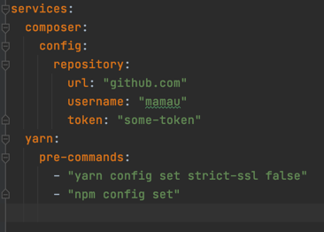

## Starter service

Позволяет не устанавливать на свой компьютер программы которые 
сопутствуют разработке, такие как: composer, bower, gulp, node, и тд.  
На машине необходим только Docker.  
Скачайте нужный вам бинарь, и положите в корень проекта.  

Пример
```bash
starter help
``` 
Покажет доступные команды.  
Если вы работаете с php проектом, вы наверняка используете composer,
но если вам не хочется его устанавливать локально, то Starter ваш выбор.
Положив в корень проекта бинарь запустите
```bash
starter composer i
``` 
Эта команда выполнит установку всех зависимостей и скинет vendor
в текущую директорию.  
Установить пакет:
```bash
starter composer require some/package
``` 
Для дополнительных настроек, в корне проекта можно создать starter.yaml, 
В секции pre-commands можно перечислить все команды, которые необходимо
выполнить перед основной, добавить репозиторий или настроить конфиг...
